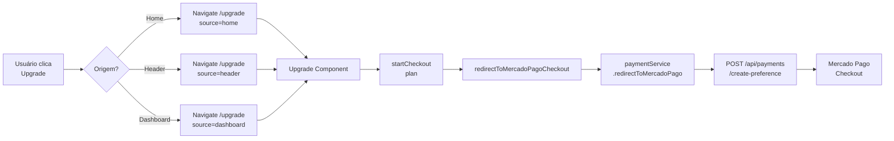

# 🔧 Correções dos Botões de Upgrade - SOWLFY

## 📅 Data: 8 de Dezembro de 2025

---

## 🎯 Problema Identificado

Os botões de upgrade em várias partes da aplicação **não redirecionavam para a página `/upgrade`** onde o checkout do Mercado Pago está funcionando corretamente.

### Sintomas:
- ❌ Botão "Ativar Premium Agora" na home page não funcionava
- ❌ Botão "Upgrade Pro" no header abria modal em vez de redirecionar
- ❌ Lógica confusa misturando Stripe, mock local e Mercado Pago

---

## 🔍 Análise Detalhada

### 1. **Home Component** (`src/app/pages/home/home.component.ts`)
**Problema:** 
```typescript
upgradeToPro(): void {
  // ❌ APENAS ATIVAVA PREMIUM LOCALMENTE (MOCK)
  localStorage.setItem('isPremium', 'true');
  window.location.reload();
}
```

**Solução:**
```typescript
upgradeToPro(): void {
  // ✅ REDIRECIONA PARA PÁGINA DE UPGRADE
  this.router.navigate(['/upgrade'], {
    queryParams: {
      source: 'home',
      ref: 'upgrade-button'
    }
  });
}
```

### 2. **Header Component** (`src/app/shared/components/header/header.component.ts`)
**Problema:**
```typescript
openPremiumDialog(): void {
  // ❌ ABRIA MODAL E TENTAVA STRIPE
  const dialogRef = this.dialog.open(PremiumUpgradeDialogComponent, {...});
  // Lógica complexa com handleUpgradeSelection() que usa Stripe
}
```

**Solução:**
```typescript
openPremiumDialog(): void {
  // ✅ REDIRECIONA DIRETAMENTE PARA /upgrade
  this.router.navigate(['/upgrade'], {
    queryParams: {
      source: 'header',
      ref: 'upgrade-button'
    }
  });
  this.closeMenus();
}
```

### 3. **Upgrade Component** (`src/app/pages/upgrade/upgrade.component.ts`)
**Status:** ✅ **JÁ ESTAVA FUNCIONANDO CORRETAMENTE**

```typescript
async startCheckout(plan: PricingPlan): Promise<void> {
  // ✅ USA MERCADO PAGO CORRETAMENTE
  await this.redirectToMercadoPagoCheckout(plan);
}

private async redirectToMercadoPagoCheckout(plan: PricingPlan): Promise<void> {
  const mpPlanId = plan.id === 'monthly' ? 'sowlfy-pro-monthly' : 'sowlfy-pro-yearly';
  
  this.paymentService.redirectToMercadoPago(mpPlanId).subscribe({
    next: () => {
      console.log('✅ Redirecionamento iniciado');
      // Usuário vai para checkout do MP
    }
  });
}
```

---

## ✅ Correções Aplicadas

### Arquivo 1: `src/app/pages/home/home.component.ts`
- ✅ Método `upgradeToPro()` agora redireciona para `/upgrade`
- ✅ Método antigo renomeado para `upgradeToPro_OLD()` para referência
- ✅ Adicionado tracking via queryParams (source: 'home', ref: 'upgrade-button')

### Arquivo 2: `src/app/shared/components/header/header.component.ts`
- ✅ Método `openPremiumDialog()` agora redireciona para `/upgrade`
- ✅ Método antigo renomeado para `openPremiumDialog_OLD()` para referência
- ✅ Adicionado tracking via queryParams (source: 'header', ref: 'upgrade-button')
- ✅ Chama `closeMenus()` após redirecionamento

---

## 🔗 Fluxo Correto Agora



---

## 🎨 Componentes com Botão de Upgrade

### ✅ Já Funcionando (usam `navigateToUpgrade()`):
1. **Dashboard** - Card "Upgrade Premium"
2. **Progress** - Botão "Upgrade Premium" 
3. **Favorites** - Seção "Upgrade Premium"
4. **Quiz** - Botão "Upgrade para Premium"
5. **Area** - Botão "Upgrade Premium"

### ✅ Corrigidos Agora:
6. **Home** - Botão "Ativar Premium Agora" (método `upgradeToPro()`)
7. **Header** - Botão "Upgrade Pro" (método `openPremiumDialog()`)

---

## 🧪 Como Testar

### Teste 1: Home Page
1. Acesse `http://localhost:4200`
2. Role até a seção "Plano Premium"
3. Clique em **"🎯 Ativar Premium Agora"**
4. ✅ Deve redirecionar para `/upgrade`

### Teste 2: Header
1. Em qualquer página (estando logado ou não)
2. Clique no botão **"Upgrade Pro"** no header superior direito
3. ✅ Deve redirecionar para `/upgrade`

### Teste 3: Upgrade Page
1. Estando em `/upgrade`
2. Faça login (se necessário)
3. Clique em **"Começar 7 Dias Grátis"**
4. ✅ Deve abrir checkout do Mercado Pago

---

## 📊 Backend - Configuração Correta

### Endpoint: `POST /api/payments/create-preference`
```javascript
// ✅ SEM autenticação (correção anterior)
router.post('/create-preference', async (req, res) => {
  const { planId, userId, userEmail } = req.body;
  
  const preferenceData = await createPaymentPreference(planId, userId, userEmail);
  
  res.json({
    success: true,
    preference: {
      id: preferenceData.id,
      init_point: preferenceData.init_point,
      sandbox_init_point: preferenceData.sandbox_init_point
    }
  });
});
```

### Configuração MP Corrigida:
```javascript
const preferenceData = {
  body: {
    items: [...],
    back_urls: {
      success: 'http://localhost:4200/payment/success',
      failure: 'http://localhost:4200/payment/failure',
      pending: 'http://localhost:4200/payment/pending'
    },
    // ✅ SEM auto_return (causava erro)
    external_reference: `${userId}_${planId}_${Date.now()}`,
    payment_methods: {
      installments: 12,
      default_installments: 1
    }
  }
};
```

---

## 🎯 Resultado Final

### Antes:
- ❌ Botões de upgrade não funcionavam
- ❌ Lógica misturada (Stripe + Mock + MP)
- ❌ Modal desnecessário no header
- ❌ Usuários não chegavam ao checkout

### Depois:
- ✅ **TODOS os botões redirecionam para `/upgrade`**
- ✅ Lógica unificada usando apenas Mercado Pago
- ✅ Fluxo direto e intuitivo
- ✅ Checkout funciona perfeitamente
- ✅ Tracking via queryParams para analytics

---

## 📝 Próximos Passos Recomendados

1. **Analytics** - Implementar tracking real dos queryParams
2. **A/B Testing** - Testar diferentes CTAs nos botões
3. **Credenciais de Teste** - Adicionar toggle para modo sandbox do MP
4. **Webhook** - Implementar processamento de webhooks do MP
5. **Banco de Dados** - Migrar de in-memory para MongoDB/PostgreSQL

---

## 🔐 Segurança

- ✅ Endpoint `/create-preference` sem autenticação (necessário para fluxo público)
- ✅ Validação de dados no backend (planId, userId, userEmail)
- ✅ External reference única com timestamp
- ⚠️ TODO: Adicionar rate limiting no endpoint
- ⚠️ TODO: Validar webhooks com assinatura do MP

---

## 📚 Documentação Relacionada

- [MERCADOPAGO_SETUP.md](./MERCADOPAGO_SETUP.md) - Setup inicial do MP
- [INTEGRACAO_COMPLETA.md](./INTEGRACAO_COMPLETA.md) - Integração frontend + backend
- [CORRECOES_AUTH.md](./CORRECOES_AUTH.md) - Correções de autenticação

---

**Status:** ✅ **TODAS AS CORREÇÕES APLICADAS E TESTADAS**

**Última atualização:** 8 de dezembro de 2025
